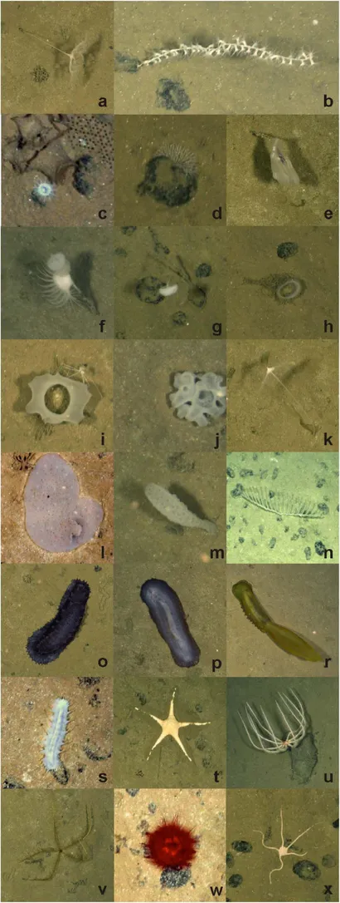
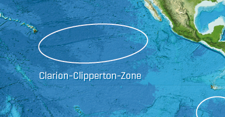
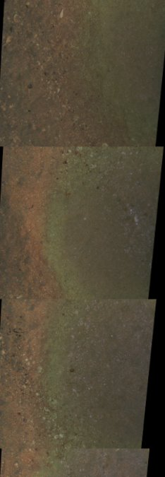
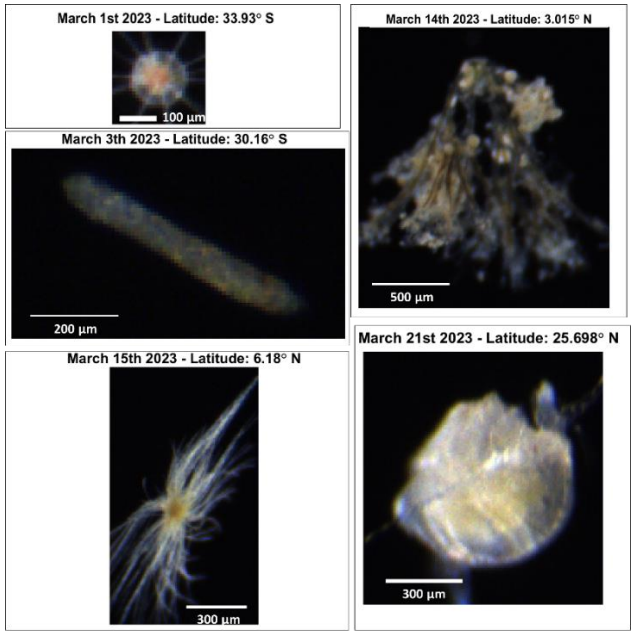
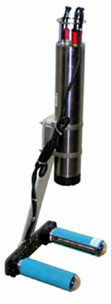

# Workshop

This page provides all the necessary setup instructions to help you make the most of the workshop. It also includes details about the dataset we will be using and the example notebooks that will guide our exercises.

## Coding environment

To ensure a smooth experience, we have set up a ready-to-use environment where all dependencies and example datasets are pre-installed. This means you won’t need to worry about installing anything manually—everything is configured and ready to go.

The environment is hosted on **notebook servers**, which are remote computing resources designed to facilitate interactive coding. These servers allow users to create, edit, and run Jupyter notebooks, which contain text, code, equations, and visualizations. Running code on a **remote notebook server** means computations will be performed on a powerful server rather than your local computer. This provides faster processing, access to specialized resources, and the flexibility to work from anywhere with an internet connection.

For this workshop, we will be using two remote services:

- **NOC's Data Science Platform (DSP)** – for NOC staff: [More information](DSP.md)
- **JASMIN** – for external users: [More information](jasmin.md)

## Tutorials

The following tutorials will be used during the workshop:

### 1) Introduction

- **Goal:** Learn how a Jupyter notebook works and how to run a simple pipeline using `Paidiverpy`
- **Link:** https://github.com/paidiver/paidiver-workshop/blob/main/tutorials/1-introduction.ipynb
- **Dataset:**
    - Benthic Images (2018) – Clarion Clipperton Zone (~5000m depth)
    - Equipment: Camera mounted on the front of an ROV

### 2) Benthic Dataset

- **Goal:** Instructions and exercises for working with a benthic dataset.
- **Link:** https://github.com/paidiver/paidiver-workshop/blob/main/tutorials/2-benthic.ipynb
- **Dataset:**
    - Benthic Images (2012) – Haig Fras, UK.
    - Equipment: Camera mounted on the front of an ROV

### 3) Pelagic Dataset

- **Goal:** Instructions and exercises for working with a pelagic dataset.
- **Link:** https://github.com/paidiver/paidiver-workshop/blob/main/tutorials/3-pelagic.ipynb
- **Dataset:**
    - Pelagic Plankton Images (2023) – DY157 RSS Discovery Cruise
    - Equipment: Red camera frame deployed vertically via winches

