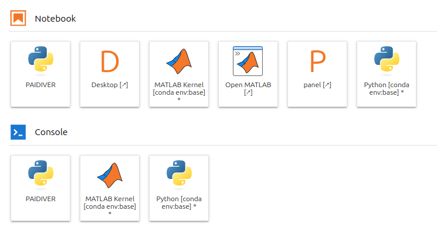
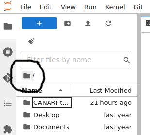
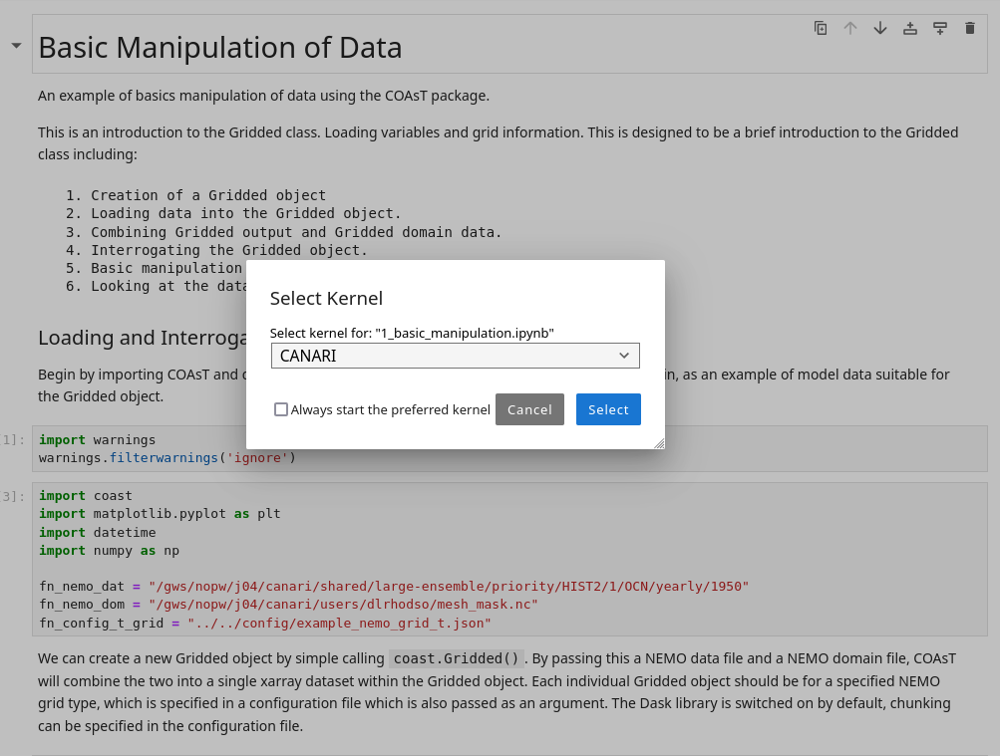

## JASMIN Documentation

### Logging into the JASMIN

To access the JASMIN environment, follow these steps:

1. In your web browser visit [https://notebooks.jasmin.ac.uk](https://notebooks.jasmin.ac.uk)
2. Login using your JASMIN username and password
3. You will then be emailed a one time code, paste this into the verification code box.
4. A Jupyter notebook interface will now be started and you can create a new notebook or open a terminal.

Your JASMIN home directory and group workspaces will be accessible from within the notebook environment.

---

### Setting up the PAIDIVERPY Conda Environment

A preconfigured PAIDIVERPY Conda environment is available for use. This environment includes all necessary packages and dependencies and is built using the `environment.yml` file from the [Paidiverpy GitHub repository](https://github.com/paidiver/paidiverpy/blob/main/environment.yml).

Since the environment is stored in a non-standard location (`/gws/nopw/j04/paidiver/paidiver-env`), Jupyter will not detect it automatically. Follow these steps to set it up:

#### 1. Open a Terminal

From the Jupyter launcher, click the **Terminal** icon.

#### 2. Register the PAIDIVER Kernel

Run the following command:

```bash
mamba run -p /gws/nopw/j04/paidiver/paidiver-env python -m ipykernel install --user --name PAIDIVER
```

#### 3. Troubleshooting

If the command above fails, try running these commands first, then repeat step 2:

```bash
mamba init
exec bash
```

#### 4. Launch Jupyter with the PAIDIVER Environment

- Open a new Jupyter launcher by clicking **File** > **New Launcher**.
- A new notebook and console option named **PAIDIVER** should now be available (this may take about a minute to appear):



- Click on **PAIDIVER** to open a notebook.

#### 5. Verify the Installation

Run the following command in the first cell:

```python
import paidiverpy
paidiverpy.__version__
```

If the output is `0.1.2`, your environment is correctly set up.

---

### Downloading the PAIDIVERPY Tutorials

To obtain the tutorials for the workshop:

- Open a terminal and run:

```bash
cd ~
git clone https://github.com/paidiver/paidiver-workshop.git
```

   This will clone the tutorials repository into your JASMIN home directory.

- Ensure you are in your home directory by clicking the **home folder** icon in the Jupyter file browser.

   

- Open the `paidiver-workshop` folder and navigate to the `tutorials` subfolder.
- You will find three Jupyter Notebook tutorials that will be used in this workshop.

---

### Running an Example Notebook

1. Open the `paidiver-workshop` folder containing the cloned repository.
2. Navigate to the `tutorials` folder.
3. Open the `introduction.ipynb` notebook.
4. If prompted to select a kernel, choose **PAIDIVER**.

   

You are now ready to start working with PAIDIVERPY in JASMIN!
